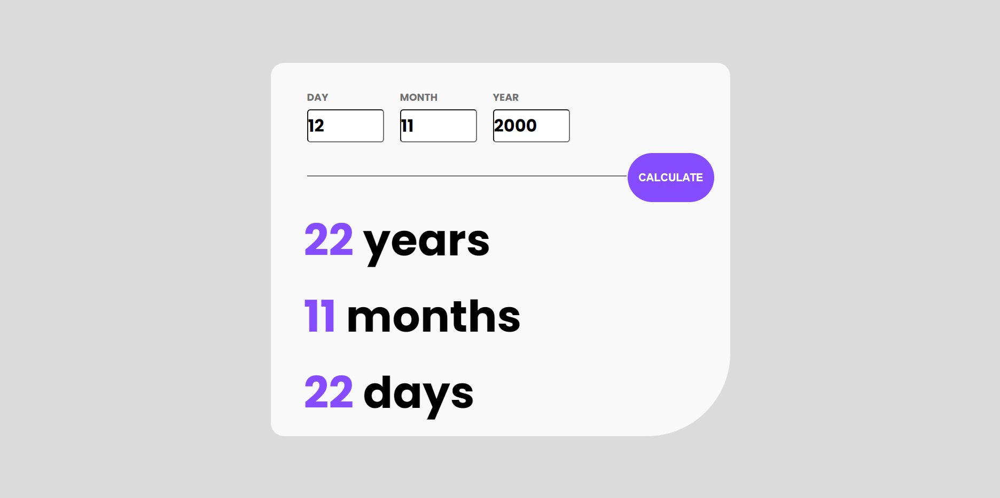

# Javascript AGE CALCULATOR
Calculadora onde o usuário entra com sua data de nascimento e vê sua idade dividida em anos, meses e dias.

  

## Tecnologias utilizadas

- Javascript
- HTML
- CSS

## :clipboard: Resultado final

### [Clique aqui e veja o projeto funcionando na prática](https://lucascostlima.github.io/age-calculator/)
